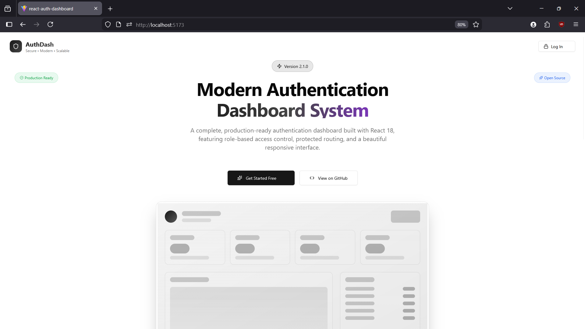
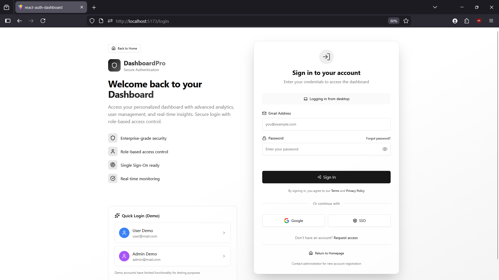
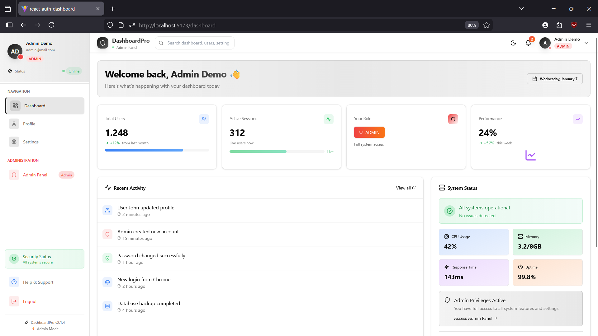
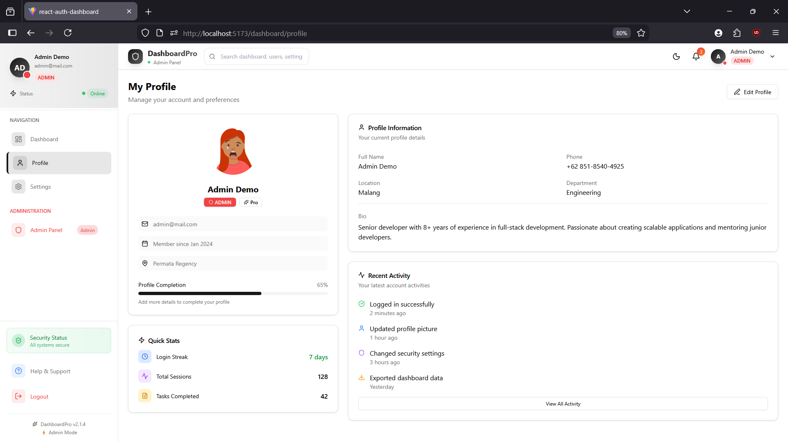
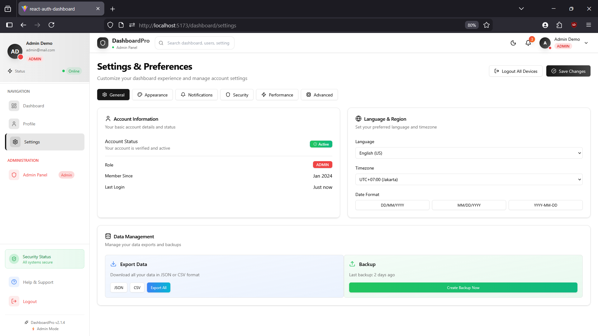
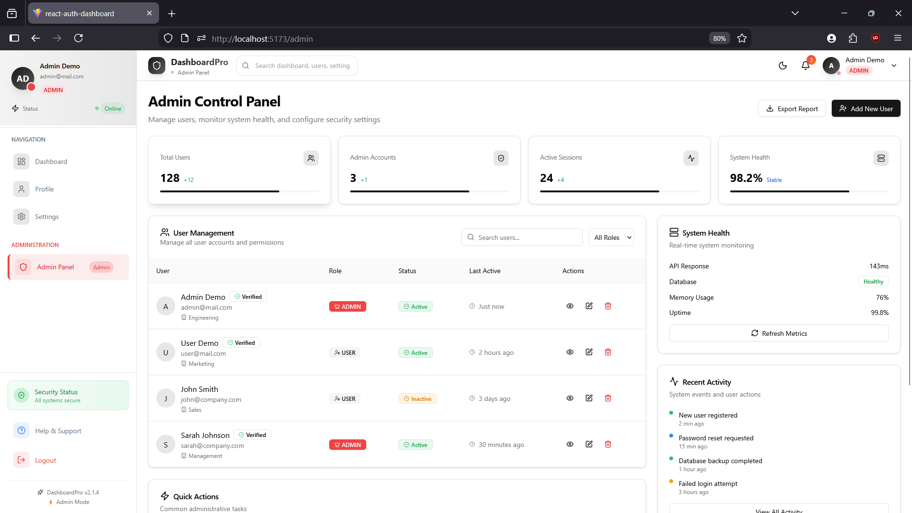

# 🚀 React Auth Dashboard

A modern and responsive **React Dashboard Application** featuring **authentication**, **protected routes**, and **role‑based access control (RBAC)**.  
This project is designed as a **learning project, portfolio showcase, and PKL task**, focusing on clean architecture, reusable components, and real‑world auth flow simulation.

---

## 📸 Screenshots

### 🏠 Home Page


### 🔐 Login Page


### 📠 Dashboard Overview


### 🧑 Profile Page


### ⚙️ Settings Page


### 🛡️ Admin Panel


---

## ✨ Features

### Authentication & Authorization
- Login & Logout system
- Persistent session using `localStorage`
- Role‑based access (User & Admin)
- Protected routes using React Router v6
- Admin‑only routes

### UI & UX
- Responsive layout (Desktop & Mobile)
- Sidebar navigation with active state
- Navbar with logout button & role badge
- Modern UI powered by Tailwind CSS & shadcn/ui
- Custom 404 (Not Found) page

### Dashboard Pages
- Overview page with stats & system info
- Profile page (user information placeholder)
- Settings page (preferences placeholder)
- Admin panel (admin‑only access)

---

## 👤 Dummy Accounts (For Testing)

Use the following accounts to test authentication and role behavior:

| Role  | Email            | Password     |
|------|------------------|--------------|
| Admin | admin@mail.com   | admin12345   |
| User  | user@mail.com    | user12345    |

---

## 🛠 Tech Stack

### Core
- **React**
- **Vite**
- **React Router v6**

### Styling & UI
- **Tailwind CSS**
- **shadcn/ui**
- **lucide-react** (icons)

### State & Auth
- **React Context API**
- **localStorage**

### Tooling
- **pnpm**
- **ESLint**

---

## 📁 Project Structure

```
src/
├── assets
├── components
│   ├── ui                # shadcn UI components
│   ├── Layout.jsx
│   ├── Navbar.jsx
│   ├── Sidebar.jsx
│   └── RoleBadge.jsx
├── context
│   └── AuthContext.jsx
├── pages
│   ├── dashboard
│   │   ├── Overview.jsx
│   │   ├── Profile.jsx
│   │   ├── Settings.jsx
│   │   └── Admin.jsx
│   ├── Home.jsx
│   ├── Login.jsx
│   └── NotFound.jsx
├── routes
│   ├── ProtectedRoute.jsx
│   └── AdminRoute.jsx
├── App.jsx
└── main.jsx
```

---

## 🧭 Routes Overview

| Route | Access |
|------|--------|
| `/` | Public |
| `/login` | Public |
| `/dashboard` | Authenticated |
| `/dashboard/profile` | Authenticated |
| `/dashboard/settings` | Authenticated |
| `/admin` | Admin only |
| `*` | Not Found |

---

## 📦 Installation & Setup

### 1️⃣ Clone Repository
```bash
git clone https://github.com/Fhrx/routewithauth.git
cd routewithauth
```

### 2️⃣ Install Dependencies
```bash
pnpm install
```

### 3️⃣ Run Development Server
```bash
pnpm dev
```

Open in browser:
```
http://localhost:5173
```

---

## 🔐 Authentication Flow

- User logs in using dummy credentials
- Auth data stored in `localStorage`
- Global auth state managed using **React Context API**
- Routes protected using:
  - `ProtectedRoute` → authenticated users
  - `AdminRoute` → admin role only
- UI elements rendered conditionally based on user role

---

## 🧪 Learning Outcomes

From this project, I learned:
- Implementing authentication flow in React
- Using React Router v6 for nested & protected routes
- Managing global state with Context API
- Building reusable UI components
- Structuring scalable React projects
- Handling role‑based UI & access control

---

## 📌 Future Improvements

- Backend authentication with JWT
- Register & Forgot Password pages
- Admin user management (CRUD)
- Real charts & analytics
- Dark mode support
- API integration

---

## 📄 License

MIT License © 2026
